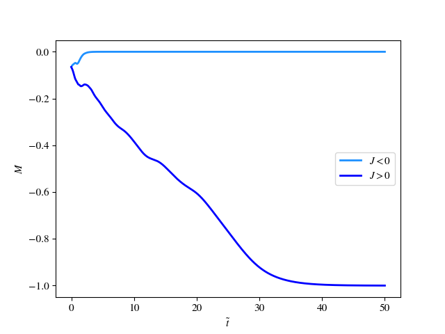
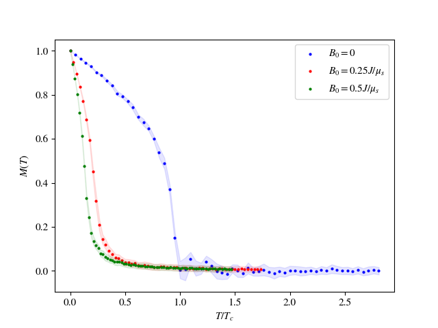

# comp-physics
Projects and exams in the course TFY4235 Computational Physics 

Results from exam
Ferro- vs Antiferromagnetism

Phase transition with the Heisenberg model, with a magnetic field present

